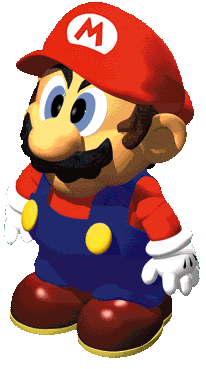

<!-- HEADER -->
<br />
<p align="center">
 <a href="https://github.com/Deathmajorasmask/MarioRPG-OpenGL">
    
 </a>

  <h3 align="center">MarioRPG-OpenGL</h3>

  <p align="center">
    An awesome videogame / graphic motor created in OpenGL !
    <br />
  </p>
</p>

<!-- TABLE OF CONTENTS -->
<details open="open">
  <summary>Table of Contents</summary>
  <ol>
    <li>
      <a href="#about-the-project">About The Project</a>
      <ul>
        <li><a href="#built-with">Built With</a></li>
      </ul>
    </li>
    <li>
      <a href="#getting-started">Getting Started</a>
      <ul>
        <li><a href="#prerequisites">Prerequisites</a></li>
        <li><a href="#installation">Installation</a></li>
      </ul>
    </li>
    <li><a href="#screenshots">Screenshots</a></li>
    <li><a href="#roadmap">Roadmap</a></li>
    <li><a href="#contributing">Contributing</a></li>
    <li><a href="#license">License</a></li>
    <li><a href="#contact">Contact</a></li>
  </ol>
</details>


<!-- ABOUT THE PROJECT -->
## About The Project

[![Product Name Screen Shot][screenshot]](https://github.com/Deathmajorasmask/MarioRPG-OpenGL)

It's a video game created in OpenGL inspired by Mario RPG that has a combat system, collisions, lights, obj exporter, among many other things. Developed in c++ and OpenGL.

The graphics engine can be used as the core for the creation of other video games or the development of this project itself. I would like to continue developing more levels and explore the possibilities of enviroment.

The possibilities with this base are endless, so I hope you can take the source code of this project as an example.

### Built With

This project uses some external libraries, I list them below:
* [GLEW](http://glew.sourceforge.net/)
* [GLFW](https://www.glfw.org/)
* [OpenGL](https://www.opengl.org)


<!-- GETTING STARTED -->
## Getting Started

Follow the instructions below to get it working and proceed to modify or test this project.

### Prerequisites

You will have to download.
* Visual Studio compatible with all version. Default project Visual studio 2015

* Install / update sdk & platform toolset compatible (140v)

### Installation

1. Clone the repo
   ```sh
   git clone https://github.com/Deathmajorasmask/MarioRPG-OpenGL.git
   ```
2. Open PF POO.sln in Visual Studio.

3. Press 'Local Windows Debugger'.


## Screenshots
![Product Name Screen Shot][screenshot04]
![Product Name Screen Shot][screenshot05]
![Product Name Screen Shot][screenshot06]


<!-- ROADMAP -->
## Roadmap

See the [open issues](https://github.com/Deathmajorasmask/MarioRPG-OpenGL/issues) for a list of proposed features (and known issues).


<!-- CONTRIBUTING -->
## Contributing

Contributions are what make the open source community such an amazing place to learn, inspire, and create. Any contributions you make are **greatly appreciated**.

1. Fork the Project
2. Create your Feature Branch (`git checkout -b feature/AmazingFeature`)
3. Commit your Changes (`git commit -m 'Add some AmazingFeature'`)
4. Push to the Branch (`git push origin feature/AmazingFeature`)
5. Open a Pull Request


<!-- LICENSE -->
## License

Distributed under the MIT License. See `LICENSE` for more information.


<!-- CONTACT -->
## Contact

Deathmajorasmask - zijaham_link@hotmail.com

Project Link: [https://github.com/Deathmajorasmask/MarioRPG-OpenGL](https://github.com/Deathmajorasmask/MarioRPG-OpenGL)


<!-- MARKDOWN LINKS & IMAGES -->
[screenshot]: images/Screen01_MarioRPG.JPG
[screenshot04]: images/Screen04_MarioRPG.JPG
[screenshot05]: images/Screen05_MarioRPG.JPG
[screenshot06]: images/Screen06_MarioRPG.JPG